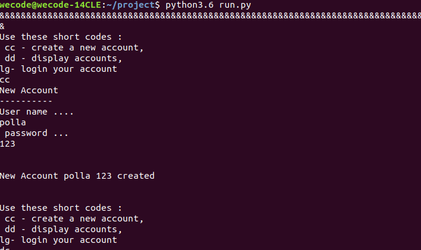

## Description
This project enables a user to store old accounts credentials and
create new ones. the program also stores. Users get the option to come up with
their own passwords or the program can generate one for them. the program further
displays the user accounts and passwords upon being prompted.
## Behavior Driven Development(BDD)
<<<<<<< HEAD

##SetUp/Instructions
   
=======
  
## SetUp/Instructions
>>>>>>> 8e713bebe8b5a330b896737194387984cf980810
   * python3.6
   * pyperclip
## Technology Used
* Python3.6
## License
   copyright(c)pamy
